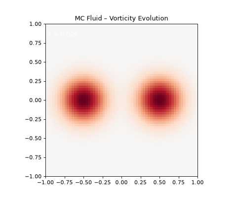
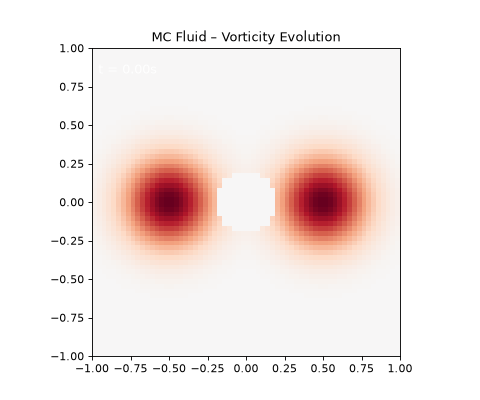
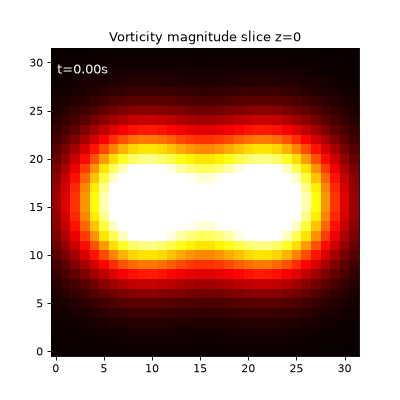
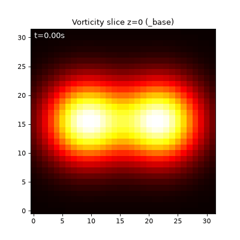
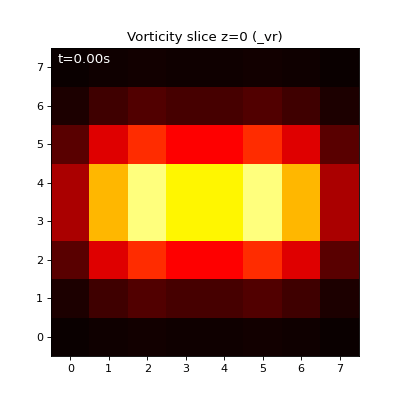

# Monte Carlo Fluid Simulation

复现 **Rioux‑Lavoie & Sugimoto et al. (2022)** 的蒙特卡洛流体求解器，
从 2D 无粘欧拉方程逐步扩展到 3D Navier‑Stokes 方程，
并引入方差缩减技术（重要性采样、控制变量）和性能优化（NumPy 向量化、Numba JIT）。

项目分为四个阶段（Phase 1 ~ Phase 4），每个阶段为一个独立的 Python 子项目。

---

## 项目结构

```
MC_Fluid_Simulation/
├── README.md
├── requirements.txt
├── mc_fluid_step1_py/         # Phase 1: 2D 无粘 + 均匀采样 Biot‑Savart + 基础可视化
│   ├── main.py
│   ├── core/ (types.py, grid.py, biot_savart.py, simulator.py)
│   └── render/ (visualizer.py)
├── mc_fluid_step2_py/         # Phase 2: 自由滑移边界 (流函数 + Walk‑on‑Spheres)
│   ├── main.py
│   ├── core/ (types.py, grid.py, geometry.py, wos.py, simulator.py)
│   └── render/ (visualizer.py)
├── mc_fluid_step3_py/         # Phase 3: 3D Navier‑Stokes (Feynman‑Kac 扩散 + 涡拉伸)
│   ├── main.py
│   ├── core/ (types3d.py, grid3d.py, biot_savart3d.py, simulator3d.py)
│   └── render/ (visualizer3d.py)
└── mc_fluid_step4_py/         # Phase 4: 方差缩减 (重要性采样 + 控制变量 + 拉伸修复)
    ├── main.py
    ├── core/ (types3d.py, grid3d.py, biot_savart3d.py, simulator4.py)
    └── render/ (visualizer4.py)
```

---

## 安装

### 1. 克隆项目并进入根目录
```bash
git clone 
cd MC_Fluid_Simulation
```

### 2. 创建虚拟环境（推荐 Python 3.9 以上）
```bash
python3 -m venv .venv
source .venv/bin/activate   # Linux / macOS
```

### 3. 安装依赖
```bash
pip install -r requirements.txt
```

---

## 运行

每个子项目均可独立运行。进入对应目录后执行 `main.py`。

### [Phase 1（2D 无粘）](/mc_fluid_step1_py/README)

### [Phase 2（带障碍物的自由滑移边界）](/mc_fluid_step2_py/README)

### [Phase 3（3D Navier‑Stokes）](/mc_fluid_step3_py/)

### [Phase 4（方差缩减与加速）](/mc_fluid_step4_py/README)

---

## 各阶段说明

| Phase | 方程 | 维度 | 边界 | 粘性 | 拉伸 | 方差缩减 | 主要算法 |
|-------|------|------|------|------|------|----------|----------|
| 1 | Euler | 2D | 无 | ❌ | ❌ | ❌ |均匀 Biot‑Savart + 半拉格朗日 + 网格缓存|
| 2 | Euler | 2D | 自由滑移 | ❌ | ❌ | ❌ |流函数 + WoS + 对偶采样 |
| 3 | Navier‑Stokes | 3D | 无（开放域） | ✅ | ✅ | ❌ |Feynman‑Kac (扩散) + 涡分段法拉伸 |
| 4 | Navier‑Stokes | 3D | 无（开放域） | ✅ | ✅ | ✅ |重要性采样 + 控制变量 + 拉伸修复 |

### 优点
- **无网格生成**：仅需均匀缓存和最近点查询，无需体网格。
- **点式求解**：可在任意位置/时间估计解，无需全局求解。
- **天然并行**：每个网格点的计算独立，适合 GPU / 多核。
- **几何灵活**：WoS 方法可直接处理复杂边界（多边形、隐式曲面等）。

### 缺点与局限
- **计算效率低**（已优化但仍远不如传统网格法），尤其 3D + WoS 场景。
- **数值耗散大**：线性插值和半拉格朗日平流会快速抹平高频涡量细节。
- **方差大**：低样本数时速度估计噪声导致非物理的涡量尖峰。
- **控制变量实现尚不完善**：当前 Phase 4 VR 版本效果不如预期，需要高质量初始缓存。

---

## 结果示例

### Phase 1：涡量场演化（64²，两高斯涡旋绕转）


### Phase 2：绕圆形障碍物流动（64²，WoS 边界）


### Phase 3：3D 涡环切片（16³）


### Phase 4：方差缩减对比（32³）
| Base | VR |
|------|----|
|  |  |

> 详细误差报告见各 `output/report*.txt`。

---

## 许可

本项目仅用于学术研究目的。代码基于 ACM SIGGRAPH 论文的公开思想重写，不包含原作者的受版权保护的代码。

---

## 参考文献

- Damien Rioux‑Lavoie, Ryusuke Sugimoto, et al. *A Monte Carlo Method for Fluid Simulation*. ACM Trans. Graph. 41(6), 2022.
- Ryusuke Sugimoto, Christopher Batty, Toshiya Hachisuka. *Velocity‑Based Monte Carlo Fluids*. SIGGRAPH 2024.
- Rohan Sawhney, Keenan Crane. *Monte Carlo Geometry Processing*. ACM Trans. Graph. 39(4), 2020.
